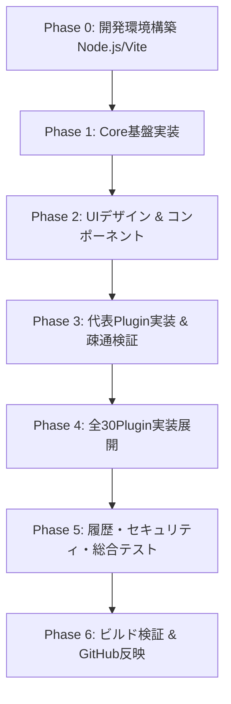

# AI開発初心者お助けナビ（AI Dev Beginner Navigator）
# 実装計画書 — IMPLEMENTATION_PLAN.md

* **文書バージョン**: 1.0.0
* **作成日**: 2026-09-04
* **準拠仕様**: 仕様書.md (Version 1.0.0 確定版)
* **対象プロジェクト**: `tk030-lotto/ai-dev-beginner-navigator`
* **ライセンス**: MIT License

---

## 1. プロジェクト概要・開発方針

### 1.1 目的と基本思想
本プロジェクトは、AI開発における初心者の最大の障壁である**「自分が何に困っているのかを技術的な言葉に変換できない」**という問題を解消するための、完全ブラウザ完結型ナビゲーションツールです。

* **逆引き検索ファースト**: 初心者の日常的な言葉（例：「GitHubに載せたい」「赤い文字が出た」）から技術概念・解決手順・AIへの聞き方へ導く
* **Micro-Core & Plugin指向**: Coreは共通基盤（登録・検索・履歴・UIルーティング）のみを担当し、具体的な知識コンテンツはすべて独立したPluginとして分離する
* **完全クライアントサイド完結**: サーバー不要・AI APIキー不要・アカウント不要で、ユーザーの入力や履歴を外部へ一切送信しない

### 1.2 技術スタック選定
仕様書の要件（高速表示、クライアントサイド動作、TypeScript型定義）に基づき、以下のスタックを採用します。

| 領域 | 技術選定 | 選定理由 |
| :--- | :--- | :--- |
| **ランタイム / ビルド** | Node.js (LTS) + Vite | 高速なHMR、ゼロコンフィグTypeScriptサポート、静的アセット最適化 |
| **言語** | TypeScript (Strict Mode) | 仕様書第5章で定義された `ProblemPlugin`, `CategoryType` などの厳密な型安全性 |
| **スタイリング** | Vanilla CSS (CSS Variables + Modern Layout) | 外部UIフレームワークに依存せず、軽量かつ仕様に合わせた柔軟なUI/レスポンシブデザイン |
| **ストレージ** | LocalStorage (StorageService抽象化) | サーバーレスで即時永続化。将来のIndexedDB移行を見据えたインターフェース分離 |
| **デプロイ形態** | 静的HTML/CSS/JS (SPA) | GitHub Pagesや任意の静的ホスティングで即時公開可能 |

---

## 2. システムアーキテクチャ & ディレクトリ構成

### 2.1 レイヤードアーキテクチャ
```text
┌──────────────────────────────────────────────────────────┐
│                      UI Layer                            │
│  TopSearchBar / CategoryFilter / ResultList / SolutionView│
│  PromptGenerator / HistoryDrawer / SafeRedactorAlert     │
└────────────────────────────┬─────────────────────────────┘
                             │ Events / State
┌────────────────────────────▼─────────────────────────────┐
│                      Core Layer                          │
│  PluginRegistry  │  SearchEngine  │  HistoryService      │
│  (登録・検証)     │  (スコア・シノニム)│  (保存・入出力)      │
└────────────┬───────────────┴─────────────────────────────┘
             │ Reads
┌────────────▼─────────────────────────────────────────────┐
│                     Plugin Layer                         │
│  Error (5)  │  AI (10)  │  Git (6)  │  File (5)  │ Dev (4)│
└──────────────────────────────────────────────────────────┘
```

### 2.2 推奨ディレクトリ構成
```text
ai-dev-beginner-navigator/
├── .gitignore
├── README.md
├── 仕様書.md
├── 実装計画書.md                # 本文書
├── package.json
├── tsconfig.json
├── vite.config.ts
├── index.html
├── public/
│   └── favicon.svg
└── src/
    ├── types/                 # 仕様書第5章・第9章に完全準拠した型定義
    │   ├── plugin.ts          # ProblemPlugin, PluginMetadata, CategoryType等
    │   ├── search.ts          # SearchResult, SearchQuery
    │   └── history.ts         # ActivityLog, StorageInterface
    ├── core/                  # Micro-Core (個別Plugin知識を一切持たない)
    │   ├── registry.ts        # PluginRegistry (登録・一覧取得・ID検索)
    │   ├── search.ts          # SearchEngine (重み付きスコアリング + シノニム展開)
    │   ├── synonyms.ts        # シノニム辞書定義 (仕様書第7章準拠)
    │   ├── sanitizer.ts       # 秘匿情報マスク (第10章 APIキー等の置換)
    │   └── history.ts         # HistoryStore (LocalStorage操作・上限500件・JSON入出力)
    ├── plugins/               # 初期30Plugin（独立モジュール）
    │   ├── error/             # 1. err-explainer 〜 5. err-fix-checker
    │   ├── ai/                # 6. ai-prompt-creator 〜 15. ai-post-check
    │   ├── git/               # 16. cmd-explainer 〜 21. git-trouble-helper
    │   ├── file/              # 22. file-structure 〜 26. file-cleaner
    │   ├── dev/               # 27. dev-md-formatter 〜 30. dev-ai-vs-human
    │   └── index.ts           # 全プラグインの一括エクスポート & Registry登録
    ├── ui/                    # 画面表示・コンポーネント群
    │   ├── components/
    │   │   ├── search-bar.ts  # トップ検索入力・プレースホルダー回転
    │   │   ├── category-tabs.ts # 5大カテゴリ切り替えタブ
    │   │   ├── result-card.ts # 検索結果カード（関連度・概要）
    │   │   ├── solution-view.ts# 5段構成解決画面（概要/手順/注意/AI相談/関連）
    │   │   ├── prompt-box.ts  # プロンプト生成・OS/言語変数差込・ワンクリックコピー
    │   │   └── history-modal.ts # 履歴閲覧・JSONエクスポート/インポート/全消去
    │   ├── styles/
    │   │   ├── variables.css  # カラーパレット・タイポグラフィ・余白
    │   │   ├── base.css       # リセット・ベーススタイル
    │   │   └── components.css # カード・ボタン・タグ・モーダル等
    │   └── router.ts          # 簡易ハッシュルーティング (#/ #/plugin/:id #/history)
    └── main.ts                # アプリケーション初期化・ブートストラップ
```

---

## 3. 機能要件の実装詳細

### 3.1 F-01, F-02: 検索エンジン & シノニム辞書
* **検索スコアリング計算式 (仕様書 6.2準拠)**:
  $$\text{Score} = (\text{beginnerPhrases一致} \times 3) + (\text{keywords一致} \times 2) + (\text{name一致} \times 2) + (\text{description一致} \times 1) + (\text{summary一致} \times 1)$$
* **シノニム展開 (仕様書 第7章)**:
  検索クエリ入力時に、シノニム辞書（「載せたい」→ `push`, `deploy`, `publish` など）を参照して内部検索語を拡張。
* **カテゴリフィルタ**: All / Error / AI / Git / File / Dev Support の絞り込み機能。

### 3.2 F-03, F-04, F-05, F-06: 解決ビュー & AI質問生成
* **5段構成表示 (仕様書 13.3準拠)**:
  1. **まず知っておくこと** (`knowledge.summary`)
  2. **解決手順** (`knowledge.steps`: 番号付きステップ、解説、参考コマンド)
  3. **注意・やってはいけないこと** (`knowledge.cautions`: 警告アラートスタイル)
  4. **AIに相談する** (OS・プログラミング言語・困りごと詳細の入力欄 + テンプレート展開 + 生成文クリップボードコピー + ChatGPT/Gemini/Claude Webリンク)
  5. **関連する困りごと** (同一カテゴリまたは関連タグのPluginサジェスト)
* **セキュリティ・サニタイズ (仕様書 第10章)**:
  AI質問文にユーザーがエラーログやコードを貼り付けた際、APIキーやトークン（`sk-...`, `ghp_...`, `AWS_...` など）を正規表現で検出し `[REDACTED]` へ自動マスクする注意警告機能。

### 3.3 F-07 〜 F-10: 履歴管理
* **記録対象**: `search`（検索クエリ）、`view_plugin`（プラグイン閲覧）、`generate_prompt`（プロンプト生成）
* **制約**: 最大500件（FIFO自動削除）。
* **機能**: 履歴一覧表示、1件削除、全消去、JSONファイルダウンロード（エクスポート）、JSONファイル読み込み（インポート）。

---

## 4. 初期30プラグインの実装定義

仕様書第8章で定められた全30プラグインを以下の通り実装します。

| No | ID | カテゴリ | プラグイン名 | 主な初心者フレーズ |
| :--- | :--- | :--- | :--- | :--- |
| 1 | `err-explainer` | error | エラー翻訳・要約ナビ | 赤い文字が出た / エラーの意味がわからない / 英語で読めない |
| 2 | `err-cause-finder` | error | 原因切り分けガイド | なんで動かないの / さっきまで動いてた / 原因がわからない |
| 3 | `err-log-cleaner` | error | ログ抜粋・整理ツール | ログが長すぎる / どこをAIに見せればいい？ / 長文エラー |
| 4 | `err-ai-consultant` | error | エラー相談プロンプト生成 | AIにエラーをどう聞く？ / 直し方を聞きたい |
| 5 | `err-fix-checker` | error | 修正案安全性チェッカー | AIの言った通りにして大丈夫？ / コードを上書きしていい？ |
| 6 | `ai-prompt-creator` | ai | 開発用プロンプト作成ナビ | AIへの指示の書き方 / プロンプトのテンプレート |
| 7 | `ai-instruction-check`| ai | 指示文抜け漏れ診断 | 伝わらない / AIが意図と違うコードを出す |
| 8 | `ai-task-delegation` | ai | AIへの作業依頼分割ガイド | 一気に頼みすぎて失敗した / 小分けにして頼みたい |
| 9 | `ai-response-organizer`| ai | 回答整理・要点抽出 | AIの回答が長くて難しい / 結局何すればいい？ |
| 10| `ai-todo-extractor` | ai | 次のアクション抽出 | 次に何をすればいい？ / TODOの整理 |
| 11| `ai-answer-compare` | ai | AI回答比較・検証 | 別のAIにも聞きたい / どっちの答えが正しい？ |
| 12| `ai-diff-analyzer` | ai | コード差分確認ナビ | どこが変わったかわからない / 変更点だけ知りたい |
| 13| `ai-input-sanitizer` | ai | 送信前情報サニタイザー | パスワードやキーをAIに送って大丈夫？ / 秘密情報消したい |
| 14| `ai-pre-check` | ai | 実行前セーフティチェック | このコード動かして壊れない？ / 実行前の確認 |
| 15| `ai-post-check` | ai | 生成コード動作検証ガイド | ちゃんと動いてるか確認したい / テストのやり方 |
| 16| `cmd-explainer` | git | コマンド解説ナビ | この黒い画面のコマンド何？ / 意味を知りたい |
| 17| `cmd-risk-analyzer` | git | 危険コマンド判定 | 実行したら危ないコマンド？ / 消去コマンドの警告 |
| 18| `git-concept` | git | Git概念超入門 | コミットって何？ / プッシュとプルの違い |
| 19| `git-risk-checker` | git | Git危険操作チェッカー | resetして大丈夫？ / 強制プッシュの危険 |
| 20| `git-terms` | git | Git用語辞典 | originって何？ / HEADって何？ / ブランチとは |
| 21| `git-trouble-helper` | git | Gitトラブル救助隊 | コンフリクトした / 間違えてコミットした / 戻したい |
| 22| `file-structure` | file | プロジェクト構成ナビ | どのフォルダに何を置く？ / ファイル構成がわからない |
| 23| `file-ext-explainer` | file | 拡張子ガイド | .jsonって何？ / .envって何？ / ファイルの種類 |
| 24| `file-config-checker`| file | 設定ファイル見取り図 | package.jsonの読み方 / tsconfigって何？ |
| 25| `file-env-safety` | file | 環境変数・.env保護ガイド | .envをGitHubに上げちゃダメ？ / APIキーの隠し方 |
| 26| `file-cleaner` | file | 不要ファイル整理ナビ | どれを消していい？ / node_modulesって消して平気？ |
| 27| `dev-md-formatter` | dev-support | Markdown作成ナビ | READMEの書き方 / メモをきれいにまとめたい |
| 28| `dev-md-table` | dev-support | Markdown表生成ツール | 表を作りたい / テーブルの書き方 |
| 29| `dev-json-validator` | dev-support | JSON構文チェッカー | JSONエラーが出た / カンマの位置がわからない |
| 30| `dev-ai-vs-human` | dev-support | AI任せ vs 人間確認境界ガイド| どこまでAIに任せていい？ / 自分で確認すべきところ |

---

## 5. 実装フェーズとステップ詳細



### Phase 0: 開発環境構築
* Node.js (LTS) のセットアップ
* Vite + TypeScript プロジェクト初期化
* プロジェクト設定（tsconfig, package.json scripts, .gitignore確認）

### Phase 1: Core基盤実装
* `types/`: `CategoryType`, `ProblemStep`, `PromptTemplate`, `PluginMetadata`, `ProblemPlugin`, `ActivityLog` 等の定義
* `core/registry.ts`: Pluginの登録、重複検証、カテゴリ別取得、全件取得
* `core/synonyms.ts`: 初心者語句と技術概念の対応辞書
* `core/search.ts`: 重み付きスコア検索アルゴリズム、部分一致・あいまい一致対応
* `core/sanitizer.ts`: 秘匿情報検出・置換ロジック
* `core/history.ts`: LocalStorageベースのログ保存、上限500件FIFO、インポート/エクスポート

### Phase 2: UIデザイン & コンポーネント実装
* モダン・プレミアムなデザインシステム構築（CSS変数、ダークモード基調または洗練されたモダンクリーン、美しいカードとタイポグラフィ）
* トップバー & ヒーロー検索エリア（リアルタイム検索 + 検索例タグ）
* カテゴリフィルタ（タブ / バッジ）
* 検索結果一覧（スコア順ソート、初心者フレーズハイライト）
* 解決ビュー（5段構成コンポーネント、コマンドコピー機能）
* AIプロンプト生成ボックス（環境変数入力、ワンクリックコピー、各AI Webリンクボタン）
* 履歴モーダル（タイムライン表示、JSON出力/取込、全消去）

### Phase 3: 代表Plugin実装 & 疎通検証
* Error代表: `err-explainer`
* AI代表: `ai-prompt-creator`
* Git代表: `cmd-risk-analyzer`
* File代表: `file-env-safety`
* Dev代表: `dev-json-validator`
* **検証項目**: 検索流入・シノニム変換・5段表示・プロンプト生成・コピー・履歴保存の一連フロー確認

### Phase 4: 全30Pluginの実装展開
* Error (残4件: 2〜5)
* AI (残9件: 7〜15)
* Git (残5件: 16, 18〜21)
* File (残4件: 22〜24, 26)
* Dev Support (残3件: 27, 28, 30)
* 全プラグインのRegistry一括登録

### Phase 5: 品質検証 & テスト
* 仕様書第18章（禁止事項）の厳守確認
* 仕様書第19章（完成条件）チェックリストの全項目パス確認
* 秘匿情報マスクの動作検証
* 破壊的コマンドの安全表示確認
* 各ブラウザ表示・レスポンシブ（スマホ/PC）確認

### Phase 6: ビルド確認 & リポジトリ更新
* `npm run build` による型チェックおよび静的アセット生成確認
* Gitコミット・プッシュ（GitHubプライベートリポジトリへの同期）

---

## 6. 実装上の禁止事項（仕様書 第18章の厳守）

実装時に以下の項目を徹底して排除します：
1. **Coreへ個別Pluginの知識を直接追加しない**
2. **AI APIの通信を必須化しない（完全クライアントサイド）**
3. **ユーザー入力を外部サーバーへ無断送信しない**
4. **PC上のコマンドを自動実行しない**
5. **破壊的操作（`rm`, `git reset --hard` 等）を自動実行しない**
6. **Pluginごとに勝手なデータ構造を作らず、共通型定義を厳守する**
7. **初心者向け説明を難解な専門用語だけで構成しない**

---

## 7. 完成条件チェックリスト（仕様書 第19章）

- [ ] Coreがブラウザ上で正常起動する
- [ ] PluginをRegistryへ登録できる
- [ ] 仕様書に定められた30Pluginがすべて登録されている
- [ ] 初心者表現（例：「GitHubに載せたい」）から適切なPluginが検索できる
- [ ] 検索結果一覧が正しくソート・表示される
- [ ] 解決画面で「概要」「手順」「注意事項」が表示される
- [ ] AI質問文が動的に生成され、ワンクリックでクリップボードへコピーできる
- [ ] 履歴がLocalStorageに保存され、一覧確認・削除・JSONエクスポート/インポートができる
- [ ] 秘密情報（APIキー等）の基本的なマスク処理が動作する
- [ ] 破壊的コマンドは解説と警告のみを行い、自動実行しない
- [ ] READMEおよび仕様書の内容と実装が完全に一致している
